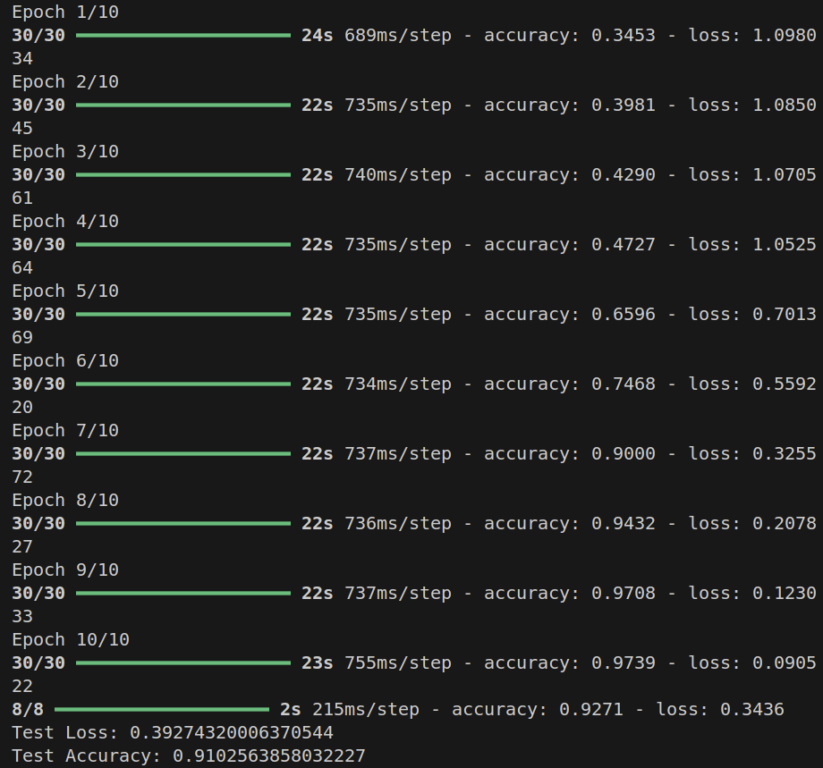
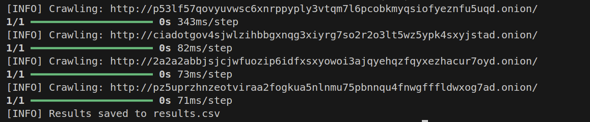
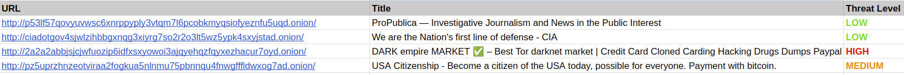

# DarkWebAI

## Description
DarkWebAI is a deep learning-powered system designed to crawl and analyze the dark web. Using advanced Natural Language Processing (NLP) models, it classifies web page content into threat levels: **High**, **Medium**, or **Low**. This project leverages the GloVe embeddings for semantic analysis and includes an LSTM-based model to enhance accuracy. 

Test Accuracy Achieved: **91.45%**
## Features
- Crawls `.onion` websites for content.
- Classifies content into predefined threat levels.
- Supports customization and extensibility with additional layers or features.
- Saves results in `results.csv` for easy analysis.

## Installation
### Setup
```bash
# Clone the repository
$ git clone https://github.com/yourusername/DarkWebAI.git
$ cd DarkWebAI

# Set up a virtual environment
$ python -m venv venv
$ source venv/bin/activate  # On Windows, use `venv\Scripts\activate`

# Install dependencies
$ pip install -r requirements.txt

# Download GloVe embeddings
$ cd data
$ wget https://nlp.stanford.edu/data/glove.840B.300d.zip
$ unzip glove.840B.300d.zip
$ mv glove.840B.300d.txt glove.txt
$ cd ..
```

---
## Usage

### Training the Model
If you want to train the model with a new dataset:
```bash
$ python train_model.py
```
Ensure `data/data.csv` is populated with appropriate `content` and `label` fields.



### Crawling and Classification
Run the `main.py` file to crawl `.onion` links specified in `links.txt` and classify their content:
```bash
$ python main.py
```
Results will be saved in `results.csv`.






---

## Contributing
Contributions are welcome! Please fork the repository and submit a pull request.

---

## License
This project is licensed under the Apache License 2.0. See the [LICENSE](LICENSE) file for details.

## Acknowledgments

- [Stanford NLP GloVe](https://nlp.stanford.edu/projects/glove/) for pre-trained embeddings.
- TensorFlow community for deep learning resources.
